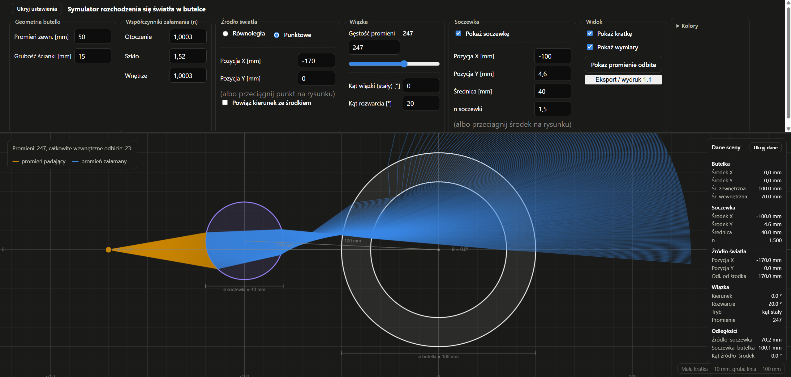

[English](README.md) | [Polski](README.pl.md)

# BottleSim

BottleSim is a 2D geometric-optics simulator that traces light rays through the circular cross-section of a bottle, with an optional circular lens placed anywhere in the scene. It is a Flask web application: a Python/NumPy backend performs the ray tracing, and a vanilla JavaScript frontend renders the scene on an HTML canvas and lets you interact with it live.



## Live demo

https://bkluj.github.io/BottleSim/

> Note: this repository currently ships a Flask (server-rendered) application. GitHub Pages only serves static files, so running BottleSim there requires either a static export of the frontend or hosting the Flask backend elsewhere — see the "GitHub Pages deployment" section below.

## Main features

- Parallel ("sun") or point ("lamp") light source, switchable at runtime
- Point source can be dragged directly on the canvas, or positioned numerically (mm)
- Fixed beam angle mode, or "aim at bottle center" mode with an adjustable offset
- Adjustable beam spread (point source) and ray density/count
- Configurable bottle geometry: outer radius and wall thickness
- Configurable refractive indices for the outside medium, the glass, and the bottle's interior
- Optional circular lens: position (X/Y), diameter, and refractive index, all in millimetres — draggable on the canvas
- Ray/lens/bottle intersection order is resolved geometrically (nearest hit wins), so a ray may hit the lens first, the bottle first, or miss either
- Toggleable reflected-ray overlay (dashed) alongside the main transmitted rays
- Millimetre measurement grid (10 mm / 50 mm / 100 mm tiers) with axis labels
- Optional technical dimension overlay (bottle/lens diameters, source/lens distances, beam angle and spread)
- Fully configurable colors (bottle, lens, incident rays, refracted rays, reflected rays, grid), persisted in the browser, with a one-click reset to defaults
- Collapsible settings HUD (toolbar) that reclaims screen space for the scene without resetting any values
- Read-only, collapsible scene-info panel showing live bottle/lens/source/beam values and derived distances/angles
- Mouse-wheel zoom and click-drag panning of the view, independent of the underlying world scale
- SVG export and a print view at true 1:1 physical scale (or 1:2 / 2:1), with page size/orientation, reference-point placement, a 100 mm calibration square, and an oversized-scene fallback

## How the simulator works

The browser sends the current form values to `POST /api/simulate`. The Flask backend (`app.py`) builds a `Bottle` and, if enabled, a `Lens` (`simulation.py`), traces every ray with NumPy, and returns each ray's path as a polyline plus total-internal-reflection flags. The frontend (`static/js/app.js`) draws the returned rays, the bottle, the lens, the grid, and all overlays on a `<canvas>`, and re-requests the simulation whenever a physical parameter changes (debounced). Purely visual changes — colors, zoom, pan, HUD collapse, dimension overlay, grid toggle — never trigger a new request; they only redraw the last received result.

## Installation

```bash
git clone https://github.com/bkluj/BottleSim.git
cd BottleSim
python -m venv .venv
.venv\Scripts\activate   # on Windows; use `source .venv/bin/activate` on macOS/Linux
pip install -r requirements.txt
```

## Development

```bash
python app.py
```

This starts the Flask development server (`debug=True`) at `http://127.0.0.1:5000/`. Edit `static/js/app.js`, `static/css/style.css`, or `templates/index.html` and reload the page to see changes — Flask's reloader restarts the server automatically when the Python files change.

There is also a small Matplotlib-based CLI, `main.py`, which renders a single parallel-beam trace through the bottle (no lens support) to a window or a saved image — useful for a quick, dependency-light check of the ray-tracing logic:

```bash
python main.py
```

## Production build

The repository does not include a production WSGI configuration. `app.run(debug=True)` in `app.py` starts Flask's built-in development server, which Flask itself warns is not meant for production use. To deploy, run the existing `app` object behind a standard production WSGI server (for example Gunicorn or Waitress) instead of calling `app.run()` directly — no such server is currently listed in `requirements.txt`.

## GitHub Pages deployment

GitHub Pages serves static files only; it cannot run the Flask backend that computes the ray tracing. This repository does not currently contain a `.github/workflows` deployment pipeline. To publish BottleSim on GitHub Pages you would need to either export a static build of the frontend against a fixed dataset, or host the Flask app separately and use Pages only for static assets.

## Usage

1. Choose a light source: **Równoległa** (parallel/"sun") or **Punktowe** (point/"lamp"), in the "Źródło światła" section.
2. For a point source, set its X/Y position (mm) or drag it directly on the canvas; optionally link its direction to the bottle center with an aim offset.
3. Adjust the beam in the "Wiązka" section: ray count/density, fixed angle or aim offset, and (for point sources) beam spread.
4. Set the bottle's outer radius, wall thickness, and the three refractive indices (outside / glass / inside).
5. Enable the lens ("Pokaż soczewkę") and set its X/Y position, diameter, and refractive index — or drag its center on the canvas.
6. Toggle the grid, dimension overlay, and reflected-ray overlay in "Widok"; customize colors in the collapsible "Kolory" section.
7. Scroll to zoom and drag empty canvas space to pan; use "Ukryj ustawienia" to collapse the HUD and reclaim canvas height.
8. Use "Eksport / wydruk 1:1" to export an SVG at true physical scale or open the print view.

## Physics background

### Geometric optics

BottleSim models light as individual rays that travel in straight lines and change direction only at material boundaries. This is the geometric-optics approximation: wave phenomena such as diffraction, interference, and polarization are not simulated.

### Law of reflection

$$\theta_i = \theta_r$$

The angle of incidence and the angle of reflection are both measured from the surface normal. The reflected direction is computed vectorially as:

$$\mathbf{r} = \mathbf{d} - 2(\mathbf{d}\cdot\mathbf{n})\mathbf{n}$$

where **d** is the incident direction, **n** is the (unit) surface normal, and **r** is the reflected direction. This is implemented directly in `simulation.py`'s `reflect()` function and used to draw the dashed reflected-ray overlay at every boundary the ray meets.

### Snell's law

$$n_1 \sin(\theta_1) = n_2 \sin(\theta_2)$$

`n_1` and `n_2` are the refractive indices on either side of a boundary, and `θ_1`/`θ_2` are the angles of incidence and refraction, both measured from the normal. A ray bends toward the normal when entering a denser medium (`n_2 > n_1`) and away from the normal when entering a less dense one. This is implemented in `simulation.py`'s `refract()` using the standard vector form of Snell's law.

### Total internal reflection

$$\theta_c = \arcsin\left(\frac{n_2}{n_1}\right), \quad n_1 > n_2$$

When light travels from a denser medium (`n_1`) into a less dense one (`n_2`) at an angle greater than the critical angle `θ_c`, no refracted ray exists — all the light reflects. In `refract()`, this is detected when the term under the square root becomes negative; the function returns `None`, `trace_ray()` marks the ray as having undergone total internal reflection, and the main ray path stops at that point (only the reflected overlay continues).

### Ray–circle intersection

A ray is parametrized as:

$$\mathbf{p}(t) = \mathbf{o} + t\mathbf{d}$$

where **o** is the ray origin, **d** is its (unit) direction, and `t ≥ 0`. Intersecting it with a circle of center **c** and radius `R` means solving:

$$\left\|\mathbf{o} + t\mathbf{d} - \mathbf{c}\right\|^2 = R^2$$

which expands into a quadratic in `t`. `ray_circle_intersection()` solves this quadratic and picks the smallest strictly positive root (`t > EPS`), i.e. the nearest intersection ahead of the ray — this is what lets the tracer pick whichever of the bottle's or lens's surfaces the ray reaches first, without assuming a fixed order.

### Circular surface normal

$$\mathbf{n} = \frac{\mathbf{p}_{hit} - \mathbf{c}}{\left\|\mathbf{p}_{hit} - \mathbf{c}\right\|}$$

The outward normal at a hit point is simply the direction from the circle's center **c** to the hit point **p**_hit. Since the same formula gives an outward-pointing normal regardless of whether the ray is entering or exiting, `trace_ray()` flips its sign whenever it points the same way as the incident ray, so it always faces back toward the incoming ray before refraction/reflection are computed.

### Bottle model

The bottle (`Bottle` in `simulation.py`) is modeled as two concentric circles sharing the same center:

- **outer boundary** — radius `outer_radius_mm`, separating the outside medium (`n_outside`) from the bottle wall (`n_glass`)
- **inner boundary** — radius `outer_radius_mm - wall_thickness_mm`, separating the wall (`n_glass`) from the bottle's interior (`n_inside`)

A ray traveling through the whole bottle therefore crosses four interfaces in sequence:

```
air (n_outside) → glass (n_glass) → interior (n_inside) → glass (n_glass) → air (n_outside)
```

Each crossing applies Snell's law (or total internal reflection); `n_inside` can represent either a liquid or air, depending on the configured value.

### Circular lens

The optional lens (`Lens` in `simulation.py`) is a second, independent circle: a homogeneous, circular refractive region with its own center, diameter, and refractive index, placed anywhere in the scene (not necessarily touching the bottle). Tracing a ray through it follows the same steps as any circular boundary:

1. find the ray's intersection with the lens circle,
2. refract on entry (ambient index → lens index),
3. propagate the ray in a straight line inside the lens,
4. find the second intersection (the exit point),
5. refract on exit (lens index → ambient index), or reflect internally if the angle exceeds the critical angle.

This is genuine geometric ray tracing through a circular region — not a thin-lens (`1/f = 1/p + 1/q`) approximation. At every step, `trace_ray()` compares the nearest pending bottle intersection against the nearest pending lens intersection and processes whichever is closer, so the lens may be hit before or after the bottle, or not at all.

### Numerical stability

- After every intersection, the next ray segment starts an `ORIGIN_EPSILON` (1e-5 mm) offset along the new direction, so it doesn't immediately re-intersect the same surface.
- Only the nearest strictly positive intersection (`t > EPS`, `EPS = 1e-8`) is ever selected, avoiding intersections behind the ray origin.
- Each ray is limited to `max_interactions` (default 20) boundary crossings, which bounds the loop even in degenerate configurations and prevents infinite recursion between the bottle and the lens.

## Model assumptions and limitations

- Purely two-dimensional: the bottle and lens are circles in cross-section, not 3D solids of revolution.
- Geometric (ray) optics only — no diffraction, no interference, no polarization.
- No wavelength-dependent dispersion: each medium has a single, fixed refractive index.
- Fresnel intensity/transmittance is not modeled — reflected and refracted rays are drawn as full-intensity paths with no energy split or attenuation.
- Surfaces are ideal mathematical circles with no roughness or scattering.
- All materials are homogeneous within their region (bottle wall, bottle interior, lens).
- Each ray is limited to a fixed number of boundary interactions (default 20).

BottleSim is an educational and visualization tool for exploring refraction, reflection, and simple lens behavior — it is not a substitute for professional optical design or simulation software.

## Project structure

```
BottleSim/
├── app.py              Flask app: HTTP routes and request parsing (/api/simulate)
├── simulation.py       Ray-tracing engine: Bottle, Lens, Snell's law, reflection, ray/circle intersection
├── main.py             Small Matplotlib-based CLI for a single parallel-beam trace (no lens)
├── requirements.txt    Python dependencies (numpy, matplotlib, flask)
├── templates/
│   └── index.html      Page markup: toolbar controls, canvas, scene inspector, export dialog
└── static/
    ├── js/app.js        Frontend logic: drawing, dragging, zoom/pan, inspector, SVG export
    └── css/style.css     Styling for the toolbar, canvas overlay, and print view
```

## Contributing
